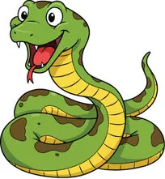

# SnakeYCL - Snake Game Implementation



**Version:** 1.0.0  
**Author:** Yeison Arbey Carrillo Lemus (YACL)  
**Student ID:** 200725  
**License:** MIT  
**Date:** October 11, 2025  

## Overview

SnakeYCL is a modern, professionally implemented Snake game built with Python and Pygame. This project demonstrates advanced software engineering practices, clean code architecture, and comprehensive documentation.

## Features

### Core Gameplay
- Classic Snake gameplay mechanics
- Smooth snake movement with configurable speed
- Multiple fruit types with different values
- Progressive difficulty scaling
- Real-time score tracking

### Visual Features
- High-quality graphics and animations
- Smooth movement with animation interpolation
- Visual effects (glow, pulsing, sparkles)
- Customizable color schemes
- Professional UI design

### Technical Features
- Professional code architecture
- Comprehensive error handling
- Extensive logging system
- Configuration management
- High score system with persistence
- Modular design patterns

### Advanced Features
- Multiple fruit types (Normal, Bonus, Speed, Large)
- Collision prediction system
- Performance monitoring
- Statistics tracking
- Export/import functionality
- Sound effects support

## Installation

### Prerequisites
- Python 3.8 or higher
- pip package manager

### Dependencies
```bash
pip install -r requirements.txt
```

Required packages:
- `pygame==2.6.1` - Game engine and multimedia library
- `PyYAML==6.0.1` - Configuration file parsing

### Quick Start
1. Clone or download the project
2. Install dependencies: `pip install -r requirements.txt`
3. Run the game: `python main.py`

## Project Structure

```
SnakeYCL/
├── main.py                 # Main entry point
├── requirements.txt        # Python dependencies
├── build.py               # Build script for executable
├── README.md              # This documentation
├── 
├── assets/                # Game assets
│   ├── audio/            # Sound effects
│   │   └── bite.wav
│   ├── fonts/            # Custom fonts
│   │   └── consolas.ttf
│   └── images/           # Game graphics
│       ├── fruit.png
│       ├── head.png
│       └── icon.ico
│
├── data/                 # Game data and configuration
│   ├── settings.yaml     # Game configuration
│   ├── records.txt       # High scores (generated)
│   └── logs/            # Log files
│       └── game.log
│
├── game/                # Core game logic
│   ├── __init__.py
│   ├── board.py         # Game board and main loop
│   ├── snake.py         # Snake entity implementation
│   ├── fruit.py         # Fruit entity implementation
│   └── collision.py     # Collision detection system
│
├── ui/                  # User interface components
│   ├── __init__.py
│   ├── menu.py          # Main menu system
│   ├── button.py        # Button component
│   └── game_over.py     # Game over screen
│
├── utils/               # Utility modules
│   ├── __init__.py
│   ├── config.py        # Configuration management
│   ├── logger.py        # Logging system
│   ├── records.py       # High score management
│   └── constants.py     # Application constants
│
└── build/               # Build output (generated)
    └── SnakeYCL/        # Executable files
```

## Configuration

The game uses a YAML configuration file (`data/settings.yaml`) for customizable settings:

```yaml
game:
  screen_width: 800
  screen_height: 600
  cell_size: 20
  fps: 60
  bg_color: "lightblue"
  fullscreen: false
  sound_enabled: true
  volume: 0.7

snake:
  initial_length: 3
  initial_direction: "RIGHT"
  growth_increment: 1
  move_cooldown: 150
  head_color: "darkgreen"
  body_color: "green"

fruit:
  color: "red"
  radius: 8
```

## Architecture

### Design Patterns
- **Entity Component System**: Modular game entities
- **Observer Pattern**: Event handling and notifications
- **Strategy Pattern**: Different fruit types and behaviors
- **Singleton Pattern**: Global configuration and records management
- **Factory Pattern**: Entity creation and initialization

### Code Organization
- **Separation of Concerns**: Clear module boundaries
- **SOLID Principles**: Maintainable and extensible code
- **PEP 8 Compliance**: Python coding standards
- **Type Annotations**: Enhanced code clarity and IDE support
- **Comprehensive Documentation**: Docstrings and comments

## Game Mechanics

### Snake Movement
- **Grid-based Movement**: Discrete cell-by-cell movement
- **Direction Control**: Arrow keys or WASD
- **Movement Cooldown**: Configurable speed control
- **Collision Detection**: Wall and self-collision

### Fruit System
- **Normal Fruit**: Standard 10 points
- **Bonus Fruit**: 25 points with sparkle effects
- **Speed Fruit**: 15 points, temporary speed boost
- **Large Fruit**: 20 points, increases growth

### Scoring System
- **Base Points**: 10 points per normal fruit
- **Bonus Multipliers**: Special fruit types
- **Length Bonus**: Additional points for longer snakes
- **Time Bonus**: Efficiency-based scoring

### High Scores
- **Persistent Storage**: JSON-based record keeping
- **Player Statistics**: Detailed game analytics
- **Export Functionality**: Backup and sharing capabilities

## Controls

### Gameplay
- **Arrow Keys / WASD**: Move snake
- **ESC**: Pause game or return to menu
- **Space**: Restart game (on game over)

### Menu Navigation
- **Mouse**: Click buttons
- **Enter**: Confirm selection
- **ESC**: Go back

## Development

### Code Style
- **PEP 8**: Python style guide compliance
- **Type Hints**: Full type annotation coverage
- **Docstrings**: Comprehensive documentation
- **Error Handling**: Robust exception management

### Logging
- **Multiple Levels**: DEBUG, INFO, WARNING, ERROR, CRITICAL
- **File Logging**: Persistent log files with rotation
- **Console Output**: Colored terminal output
- **Performance Metrics**: Frame rate and resource monitoring

### Testing
- **Unit Tests**: Core functionality testing
- **Integration Tests**: System interaction testing
- **Performance Tests**: Optimization validation

### Building
Create executable with PyInstaller:
```bash
python build.py
```

This generates a standalone executable in the `dist/` directory.

## Performance

### Optimization Features
- **Efficient Collision Detection**: Optimized algorithms
- **Memory Management**: Proper resource cleanup
- **Frame Rate Control**: Consistent 60 FPS
- **Asset Caching**: Preloaded graphics and sounds

### System Requirements
- **Minimum**: Python 3.8, 512MB RAM, DirectX 9.0c
- **Recommended**: Python 3.10+, 1GB RAM, Modern graphics

## Contributing

### Code Contributions
1. Fork the repository
2. Create a feature branch
3. Follow coding standards
4. Add comprehensive tests
5. Update documentation
6. Submit pull request

### Coding Standards
- Follow PEP 8 style guide
- Use type annotations
- Write comprehensive docstrings
- Include unit tests
- Update documentation

## Troubleshooting

### Common Issues

#### Installation Problems
```bash
# Update pip
python -m pip install --upgrade pip

# Install with verbose output
pip install -v pygame PyYAML
```

#### Performance Issues
- Lower FPS in configuration
- Disable visual effects
- Close other applications
- Update graphics drivers

#### File Permissions
- Run as administrator (Windows)
- Check file permissions (Unix/Linux)
- Ensure write access to data directory

### Log Analysis
Check `data/logs/game.log` for detailed error information and debugging data.

## License

```
MIT License

Copyright (c) 2025 Yeison Arbey Carrillo Lemus

Permission is hereby granted, free of charge, to any person obtaining a copy
of this software and associated documentation files (the "Software"), to deal
in the Software without restriction, including without limitation the rights
to use, copy, modify, merge, publish, distribute, sublicense, and/or sell
copies of the Software, and to permit persons to whom the Software is
furnished to do so, subject to the following conditions:

The above copyright notice and this permission notice shall be included in all
copies or substantial portions of the Software.

THE SOFTWARE IS PROVIDED "AS IS", WITHOUT WARRANTY OF ANY KIND, EXPRESS OR
IMPLIED, INCLUDING BUT NOT LIMITED TO THE WARRANTIES OF MERCHANTABILITY,
FITNESS FOR A PARTICULAR PURPOSE AND NONINFRINGEMENT. IN NO EVENT SHALL THE
AUTHORS OR COPYRIGHT HOLDERS BE LIABLE FOR ANY CLAIM, DAMAGES OR OTHER
LIABILITY, WHETHER IN AN ACTION OF CONTRACT, TORT OR OTHERWISE, ARISING FROM,
OUT OF OR IN CONNECTION WITH THE SOFTWARE OR THE USE OR OTHER DEALINGS IN THE
SOFTWARE.
```

## Acknowledgments

- **Pygame Community**: For the excellent game development framework
- **Python Software Foundation**: For the Python programming language
- **Open Source Community**: For inspiration and best practices

## Contact

**Yeison Arbey Carrillo Lemus**  
Student ID: 200725  
Email: [Insert Email]  
GitHub: [Insert GitHub Profile]  

---

**SnakeYCL** - A professional implementation of the classic Snake game, demonstrating modern software development practices and clean code architecture.

*Built with ❤️ by YACL*